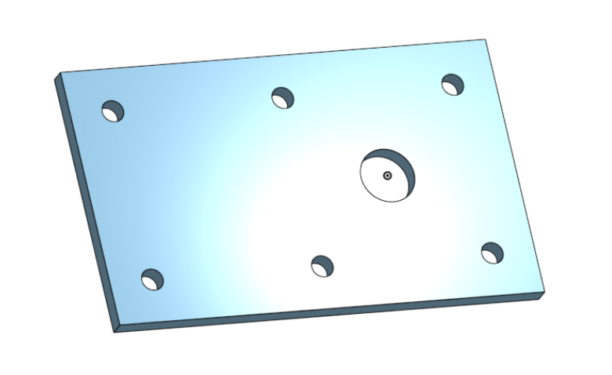
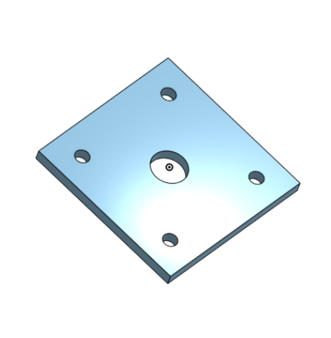
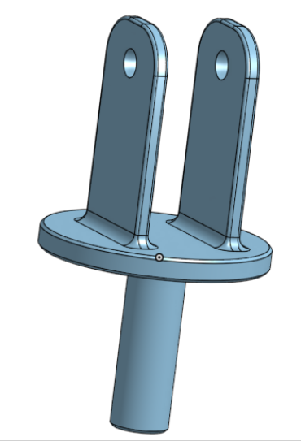
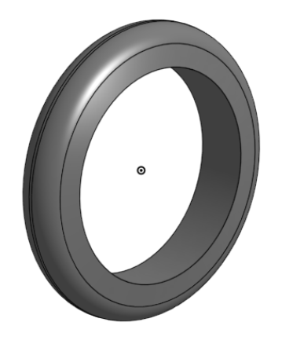
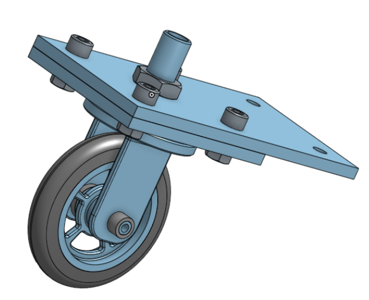

# Onshape
This is my Onshape Repo!

https://github.com/chssigma/Markdown_Cheatsheet

http://wiki.chssigma.com/index.php?title=User:Mgist56

## Base
First Onshape assignment;  make a base for caster with Onshape.
### Resources
### Images

### Takeaways

## Mount
Second Onshape assignment; make a mount for caster with Onshape. 
### Resources
### Images

### Takeaways

## Fork
Third Onshape assignment; make a fork for caster with Onshape. 
### Resources
### Images

### Takeaways

## Tire
Fourth Onshape assignment; make a tire for caster with Onshape. 
### Resources
### Images

### Takeaways

## Wheel
Fith Onshape assignment; make a wheel and bearing for caster with Onshape. 
### Resources
### Images

### Takeaways

## Axle, Collar & Bearing
Sixth Onshape assignment; make an axle, collar and bearing for caster with Onshape. 
### Resources
### Images

### Takeaways

## Wheel & Axle
Seventh Onshape assignment; make sub assembly for caster with Onshape. 
### Resources
### Images

### Takeaways

## Caster Assembly
Eighth Onshape assignment; finish entire caster assembly with Onshape. 
### Resources
### Images

### Takeaways
