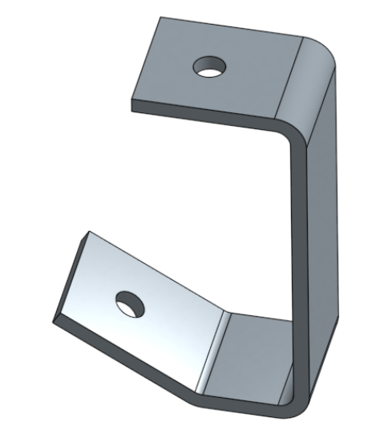

# Onshape
This is my Onshape Repo!

https://github.com/chssigma/Markdown_Cheatsheet

http://wiki.chssigma.com/index.php?title=User:Mgist56

### Table of Contents:
#### Caster

[Base](#base)

[Mount](#mount)

[Fork](#fork)

[Tire](#tire)

[Wheel](#wheel)

[Axle, Collar & Bearing](#axle-collar--bearing)

[Wheel & Axle](#wheel--axle)

[Caster Assembly](#caster-assembly)

# Caster

## Base
First Caster assignment;  make a base for caster with Onshape.
### Resources
### Images

### Takeaways

## Mount
Second Caster assignment; make a mount for caster with Onshape. 
### Resources
### Images

### Takeaways

## Fork
Third Caster assignment; make a fork for caster with Onshape. 
### Resources
### Images

### Takeaways

## Tire
Fourth Caster assignment; make a tire for caster with Onshape. 
### Resources
### Images

### Takeaways

## Wheel
Fith Caster assignment; make a wheel and bearing for caster with Onshape. 
### Resources
### Images

### Takeaways

## Axle, Collar & Bearing
Sixth Caster assignment; make an axle, collar and bearing for caster with Onshape. 
### Resources
### Images

### Takeaways

## Wheel & Axle
Seventh Caster assignment; make sub assembly for caster with Onshape. 
### Resources
### Images

### Takeaways

## Caster Assembly
Eighth Caster assignment; finish entire caster assembly with Onshape. 
### Resources
### Images

### Takeaways

# Challenge

## Cube
First Challenge assignment; create a univeral joint spider with Onshape. 
### Resources
### Images

### Takeaways

## Spinner Shaft
Second Challenge assignment; create a universal joint spinner shaft with Onshape. 
### Resources
### Images

### Takeaways

## Bracket
Third Challenge assignment; create a bracket for a universal joint with Onshape. 
### Resources
### Images

### Takeaways

## Challenge Assembly
Fourth Challenge assignment; finish entire Challenge assembly with Onshape. 
### Resources
### Images

### Takeaways
